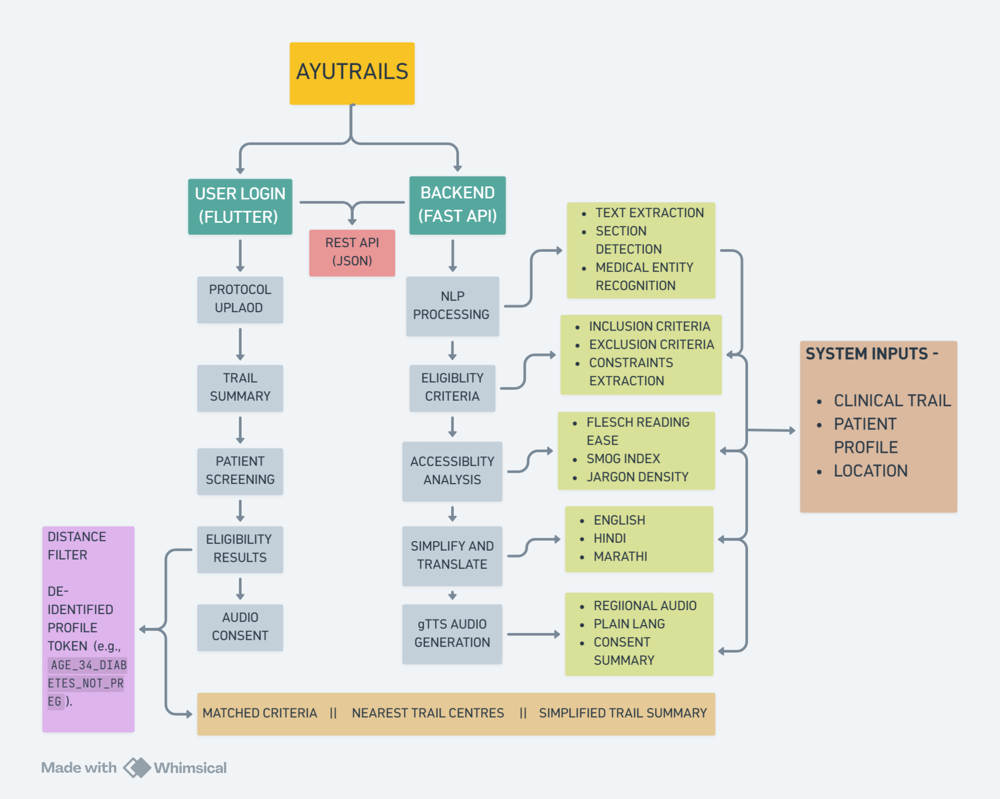

# AyuTrials

## From Medical Jargon to Meaningful Participation

### Problem Statement

Clinical trial participation remains inaccessible due to complex medical jargon, language barriers, low health literacy, and inefficient participant recruitment. These challenges lead to delayed recruitment, increased costs, and underrepresentation of diverse communities in clinical research.

---

## Solution

AyuTrials is an AI-powered platform that simplifies clinical trial protocols, performs eligibility screening, and provides multilingual accessibility support through plain-language summaries, explainable matching, and audio-based consent.

---

## Key Features

* Protocol Simplification
* Multilingual Translation
* Eligibility Screening & Matching
* Accessibility Analysis
* Audio Consent Summaries
* Explainable Match Results
* Privacy-Preserving Profiles

---

## Key Innovations

* AI-Powered Protocol Simplification
* Health Literacy Meter
* Explainable Eligibility Matching
* Regional Language Accessibility
* Audio Consent Capsules
* Privacy-First Matching

---

## Technology Stack

### Frontend

* Flutter

### Backend

* FastAPI

### AI / NLP

* spaCy
* Hugging Face Models

### Audio Processing

* gTTS

---

## System Architecture

---

## Demo Video
👉 [Watch the AyuTrials Live Demo Video Here!](https://drive.google.com/file/d/13MViopu4OABtQ0hmRm-esiDzwdjRoGWN/view?usp=sharing)

---

## Team Members

* [ vidhi gujarathi ](https://github.com/vidhigujarathi512-del)

---

## Future Scope

* OCR-Based Medical Report Processing
* FHIR/EHR Integration
* Hospital Partnerships
* Advanced Trial Recommendation Engine